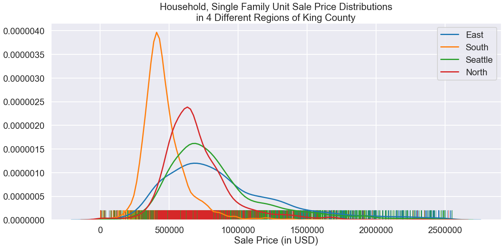
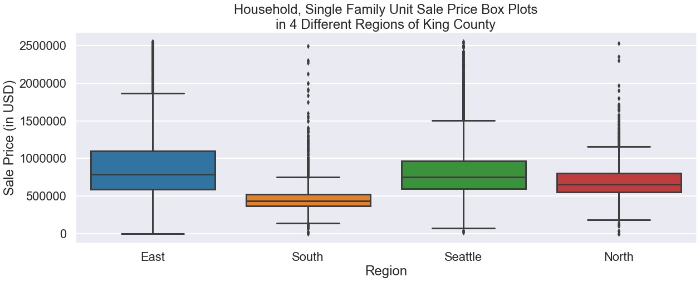
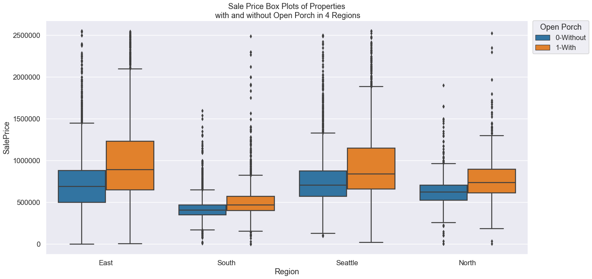
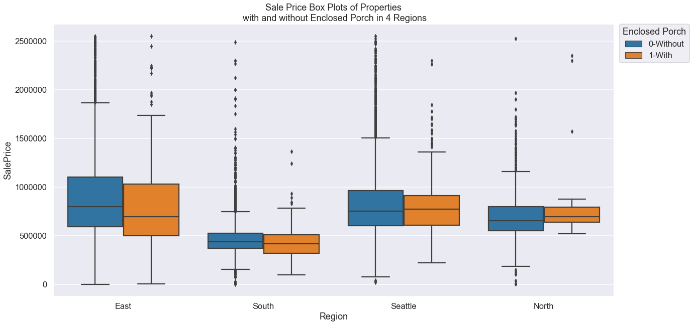
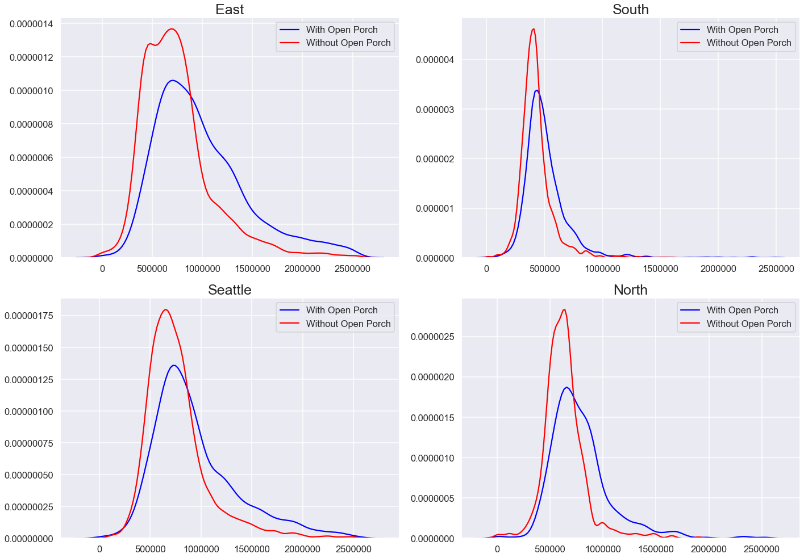
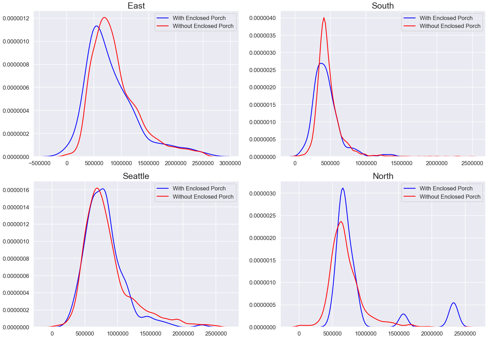
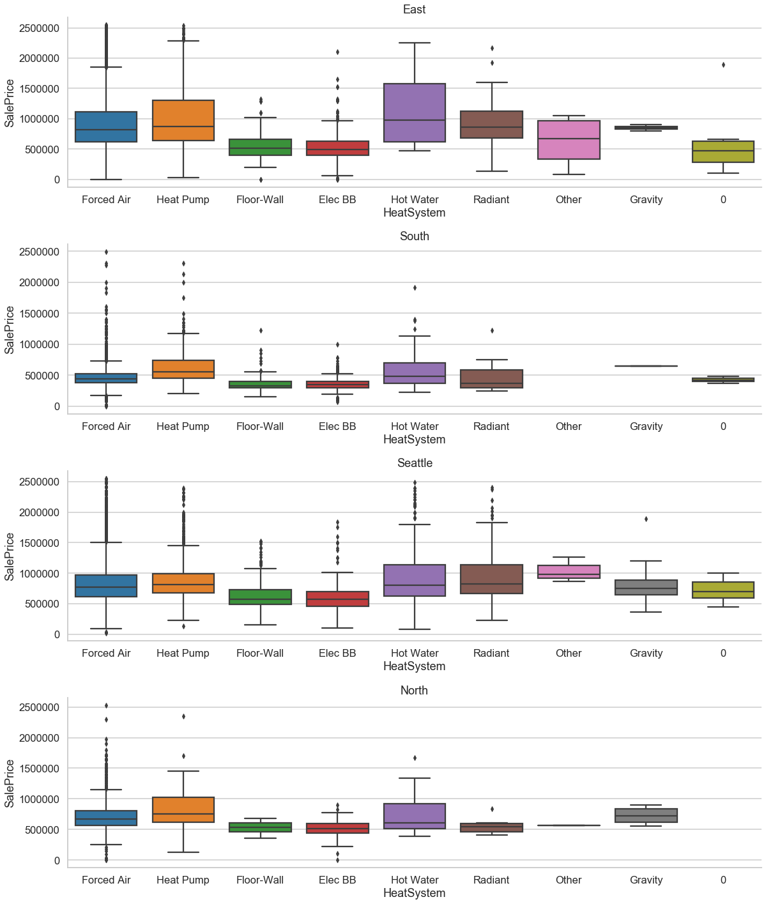
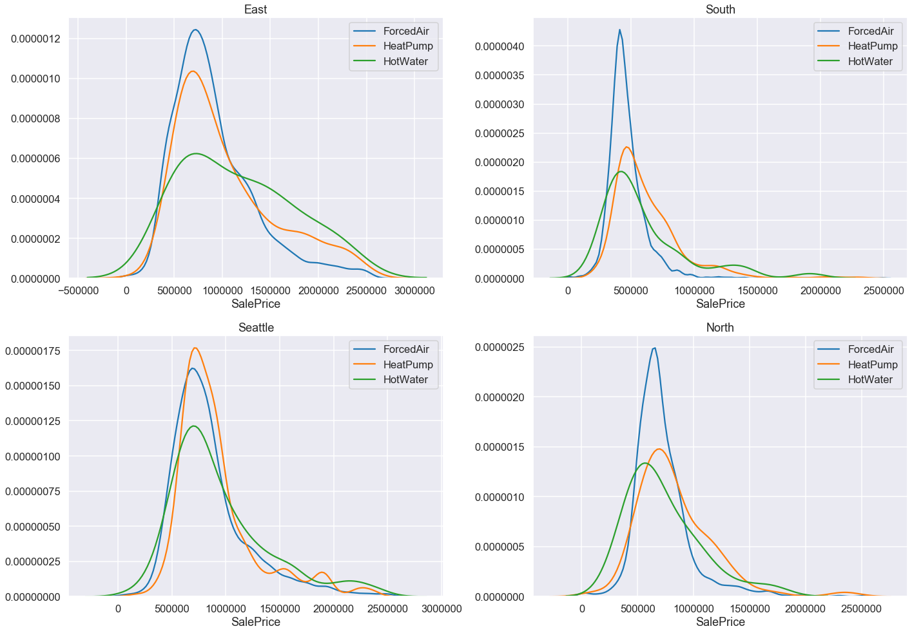
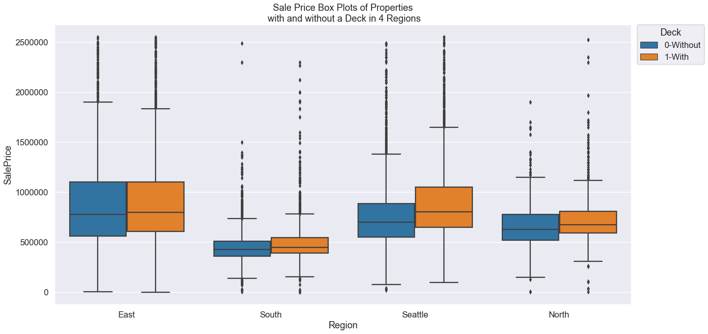
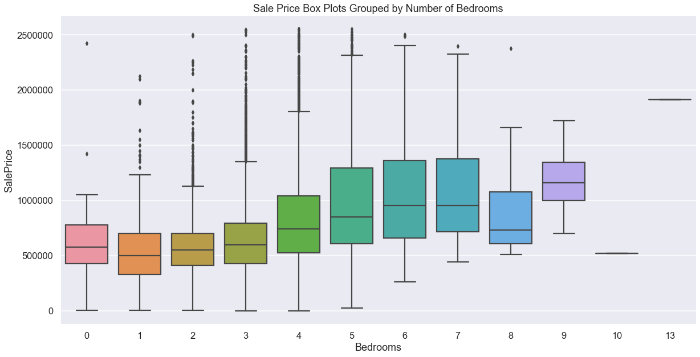

# Inferential Analysis of Real Property Sales in King County in 2019

This repository offers an analysis of factors that influence housing prices in King County, WA

## This Repository

### Repository Directory

```
├── README.md        <-- Main README file explaining the project's business case,
│                        methodology, and findings
│
├── data             <-- Data in CSV format
│   ├── processed    <-- Processed (combined, cleaned) data used for modeling
│   └── raw          <-- Original (immutable) data dump
│
├── notebooks        <-- Jupyter Notebooks for exploration and presentation
│   ├── exploratory  <-- Unpolished exploratory data analysis (EDA) notebooks
│   ├── report       <-- Polished final notebook(s)
│   └── src          <-- All relevant source code
│
├── references       <-- Data dictionaries, manuals, and project instructions
│
└── reports          <-- Generated analysis (including presentation.pdf)
    └── figures      <-- Generated graphics and figures to be used in reporting
```

### Quick Links

1. [Final Analysis Notebook](notebooks/exploratory/final_notebook.ipynb)
2. [Presentation Slides](reports/presentation.pdf)

### Setup Instructions

TODO: add setup instructions (e.g. the name of the Conda environment file)


## Business Understanding

"Expert judgments" by Real Estate professionals are sometimes found to be out-of-date, irrelevant to our specific housing market, or even inaccurate. The purpose of this project is to verify and extend on the below claims:

1. [Enclosing a porch will increase the sale price of a home](https://www.patioenclosures.com/what-is-the-value-of-adding-a-porch-enclosure-to-my-outdoor-space.aspx)
2. [Converting a garage to a bedroom is a good way to increase the sale price of a home](https://www.fool.com/millionacres/real-estate-market/home-renovations/should-you-convert-your-garage-extra-living-space/)
3. [Upgrading to a forced-air heating system will increase the sale price of a home](https://crystalheatingandcooling.com/new-hvac-unit-increase-the-overall-value-of-your-home/)


## Data Understanding

### Dataset

For this project, I have been provided with King County House Sales dataset which included 4 different tables:
1. **Real Property Sales** (`EXTR_RPSale.csv`) (located in the `data/raw` directory)
2. **Residential Building** (`EXTR_ResBldg.csv`) (located in the `data/raw` directory)
3. **Parcel** (`EXTR_Parcel.csv`) (located in the `data/raw` directory)
4. **Look Up** (`EXTR_LookUp.csv`) (located in the `data/raw` directory)
5. `King_County_Home_Sales_Data_Dictionary.pdf` (located in the `references` directory)

My understanding of the dataset can be summarized as follows:

- **Parcel** table has 81 columns and 205199 entries, each of which is a registered extended piece of land with a unique identification number (`PIN`). Each lot's PIN can be obtained by concatenating that parcel's `Major` and `Minor` columns together. The information **Parcel** contains is regarding each parcel/lot's position (Plat, Range, Township), its Area in square footage, its Water & Sewer System, Street Surface, any Restrictions it might have, different Views that can be observed from there, whether there's any type of Noises, or any type of Problems reported about that specific lot, etc.


- **ResBldg** table contains 181510 entries and 50 columns. Each entry is a present/previously registered Residential Property, as well as other information regarding that property, such as Address, number of Stories/Bathrooms/Bedrooms/Fireplaces, the Square Footage of each floor and Basement, Heat System & Heat Source, when it was Built and/or Renovated, its Condition, Grade, as well as any Additional Costs associated with it. Each property also comes with its associated `Major` and `Minor` codes, which indicates the parcel that property is on. Note that there could be multiple properties on a parcel, which means that there could be multiple entries sharing the same `Major` and `Minor`.


- **Real Property Sales** contains 351067 entries and 24 columns. Each entries is a sales transaction documented. Besides the Sale Price, it also has other information about the sale, such as the Date it was documented, Buyer/Seller, Plat, Sale Reason, etc. The unique ID for this dataframe can be obtained by concatenating the `ExciseTaxNbr` with `Major` and `Minor` to create a string of alphanumerical characters. Similar to **ResBldg**, there can be multiple sales transactions on a parcel, and multiple entries sharing the same PIN (`Major` + `Minor`).


- **Look Up** table explains the meaning of numerical codes values in the above tables. For example, Street Surface (`StreetSurface`) attribute in **Parcel** is a number with lookup code 60, which indicates that 1 means `PAVED`, 2 means `GRAVEL`, 3 means `DIRT`, and 4 means `UNDEVELOPED`.


- `King_County_Home_Sales_Data_Dictionary.pdf` file helps matching each attribute to its Look Up code, as well as any other further clarifications on how the data for that attributed is supposed to be entered.


## Data Preparation

Upon investigating the entries with the same `PIN` (`PIN = Major + Minor`) in the **ResBldg** dataset, I noticed that their values for the same attributes are usually the same and/or within the similar range.

Utilizing other resources such as **Google Maps**, as well as Real Estate websites to look up the addresses of these properties, I suspect that it's more likely these houses/apartments are part of a complex with very similar exterior as well as interior structure. Therefore, I decided to compact entries with duplicated PIN by keeping only 1 row which retains the modes for each attributes. That way `'PIN'` would become unique, and merging the 2 tables `RPSale` and `ResBldg` on `PIN` will not create a large amount of extra sales that did not really happen.

In addition, since the focus of the project is on 2019, I decided to zoom in and only look at transactions that were documented within 2019 and for the specific `"Household, single family units"` property type since it takes up the majority of the dataset.

I also removed columns that only have 1 unique value because if there's no diversity in a feature's values in the dataset, that feature would not be taken into consideration during the modeling process.

Besides, table data from the `King_County_Home_Sales_Data_Dictionary.pdf` has been converted from `.pdf` to a pandas DataFrame using the `tabula-py` package for easy mapping and converting numerical values in the master dataset to their text explanation. 

The master dataframe that was used for analysis throughout this project contains 18,320 entries and 60 columns.

### Data Engineering

- Among 60 columns of the master dataset, 14 are for the square footage of various parts of the house. In order to potentially avoid some of the problems with Multicollinearity later on, I decided to drop some columns such as `SqFt1stFloor`, `SqFtHalfFloor`, `SqFt2ndFloor`, `SqFtUpperFloor`, `SqFtUnfinFull`, `SqFtUnfinHalf`, as well as `SqFtFinBasement`. Some columns such as `SqFtGarageBasement`, `SqFtGarageAttached`, `SqFtOpenPorch`, `SqFtEnclosedPorch`, and `SqFtDeck` were converted to `has_Garage`, `has_OpenPorch`, `has_EnclosedPorch`, and `has_Deck` to purely keep track of whether a property has these features.

- Two columns `ViewUtilization`, `DaylightBasement` include empty string values `' '`, which actually takes up a good portion of the dataset. I made the assumption that empty string means 'No', and convert them to `'N'` instead.

- I also added `Yrs_BeforeSold` which keeps track of time passed since the properties were built until their sold were documented (2019).

- Instead of keeping `Yr_Renovated`, I converted its data into `been_Renovated` with values `1/0` indicating whether a property has been renovated or not. 

Note: due to my lack of knowledge in Real Estate, my interpretation of some attributes might not be 100% accurate.


## Exploratory Data Analysis (EDA)



Looking at `SalePrice` grouped by by Geographical `Region` (Reference: https://www.communitiescount.org/king-county-geographies) **East**, **South**, **Seattle**, and **North**, we can see that different regions do have different `SalePrice` distributions:
- **East**, **Seattle**, and **North** are overlapping each other more than **South** does.
- **South** Sale Price seems to have a smaller mean, smaller standard deviation, yet at very high density compared to other regions.



This observation has inspired me to proceed forward with analyzing these 4 regions separately and identifying specific house features that have more impact on `SalePrice` in some areas than in others. 


## Modeling

The final version of my model includes 4 sub-models, each of which represents `SalePrice` as a function of different features specific to each region. Features were selected using stepwise regression by prioritizing feature with statistically significant p-values. 

- Continuous columns included are: `'SalePrice', 'SqFtTotLiving', 'Yrs_BeforeSold'`
- Categorical columns identified are: `'Stories', 'BldgGrade', 'DaylightBasement', 'HeatSystem', 'HeatSource', 'ViewUtilization', 'FpSingleStory', 'FpMultiStory', 'FpFreestanding', 'FpAdditional', 'Condition', 'WaterSystem', 'SewerSystem', 'TrafficNoise', 'WaterProblems', 'been_Renovated', 'has_Garage', 'has_TotBasement', 'has_OpenPorch', 'has_EnclosedPorch', 'has_Deck', 'Bedrooms', 'BathHalfCount', 'Bath3qtrCount', 'BathFullCount'`
(Categorical features would then be converted to dummies using `sklearn`'s `OneHotEncoder()`).

### East
The **East** model includes a total of 31 predictors: 
```
Feature                   Coefficient

BldgGrade_12Luxury        7.334610e+05
BldgGrade_11Excellent     6.276256e+05
BldgGrade_10VeryGood      5.139995e+05
Intercept                 3.499718e+05
BldgGrade_9Better         3.113092e+05
been_Renovated_1          1.864937e+05
Bath3qtrCount_2           1.596372e+05
BathFullCount_4           1.464185e+05
HeatSystem_HotWater       1.420634e+05
BldgGrade_8Good           1.118976e+05
FpAdditional_2            1.114276e+05
BathFullCount_3           7.285100e+04
Condition_VeryGood        7.128985e+04
Bath3qtrCount_1           7.031951e+04
Bedrooms_2                5.722005e+04
TrafficNoise_HIGH         5.650217e+04
Condition_Good            5.001620e+04
BathHalfCount_1           3.568398e+04
has_OpenPorch_1           2.196033e+04
Yrs_BeforeSold            1.312286e+03
SqFtTotLiving             1.728627e+02
Bedrooms_4               -2.992952e+04
has_TotBasement_1        -3.058062e+04
HeatSystem_ForcedAir     -3.324645e+04
BathFullCount_1          -3.751736e+04
HeatSource_Electricity   -5.228927e+04
Stories_15               -5.700519e+04
has_Garage_1             -5.707595e+04
Stories_20               -6.806543e+04
BldgGrade_6LowAverage    -9.348136e+04
SewerSystem_PRIVATE      -1.798429e+05
FpMultiStory_4           -1.302015e+06
```

### South
The **South** model includes a total of 24 predictors: 
```
Feature                  Coefficient

BldgGrade_12Luxury       721702.828696
BldgGrade_11Excellent    578963.617759
Bath3qtrCount_4          375935.302588
FpSingleStory_5          375935.302588
BldgGrade_10VeryGood     289932.348898
Stories_30               240020.793238
Intercept                197613.449608
BldgGrade_9Better        162038.281368
Bedrooms_1               138353.756983
been_Renovated_1          88519.986429
BldgGrade_8Good           78985.823195
HeatSystem_HeatPump       72183.967173
HeatSystem_HotWater       52957.971219
HeatSource_Oil            47855.282018
Bath3qtrCount_2           43626.564850
BldgGrade_7Average        29128.533501
Condition_VeryGood        22309.739249
has_OpenPorch_1           13083.558687
Condition_Good            12502.010377
has_Deck_1                11938.616296
SqFtTotLiving                93.877156
FpMultiStory_1           -20053.434843
Bedrooms_6               -48971.410646
BldgGrade_4Low          -168706.096122
```

### Seattle
The **Seattle** model includes a total of 29 predictors: 
```
Feature                   Coefficient

BldgGrade_12Luxury        1.323574e+06
BldgGrade_11Excellent     1.010147e+06
BathFullCount_5           9.647607e+05
BldgGrade_10VeryGood      7.799366e+05
BldgGrade_9Better         4.964302e+05
BldgGrade_8Good           2.509032e+05
Bedrooms_1                1.563462e+05
Intercept                 9.998694e+04
Stories_25                9.501144e+04
BldgGrade_7Average        9.153286e+04
BathHalfCount_2           8.540038e+04
Condition_VeryGood        6.391794e+04
HeatSystem_HeatPump       5.450907e+04
BathFullCount_3           4.423805e+04
FpMultiStory_1            4.390513e+04
Condition_Good            3.832264e+04
has_OpenPorch_1           2.450902e+04
Stories_20                2.257831e+04
has_Deck_1                2.177294e+04
Yrs_BeforeSold            2.139469e+03
SqFtTotLiving             2.148742e+02
HeatSource_Electricity   -3.606570e+04
DaylightBasement_Y       -3.789555e+04
has_EnclosedPorch_1      -3.856235e+04
TrafficNoise_HIGH        -4.452642e+04
FpAdditional_1           -6.583044e+04
TrafficNoise_EXTREME     -8.227120e+04
Bedrooms_6               -1.153006e+05
Bedrooms_9               -6.830870e+05
```

### North
The **North** model includes a total of 12 predictors: 
```
Feature                  Coefficient
BldgGrade_11Excellent    529635.931261
BldgGrade_10VeryGood     362328.130749
Intercept                301768.878172
BldgGrade_9Better        208055.561190
has_EnclosedPorch_1      138693.658964
been_Renovated_1         131178.994186
BldgGrade_8Good           82155.893172
Condition_VeryGood        77249.593463
HeatSource_Oil            52164.369115
SqFtTotLiving               153.463189
TrafficNoise_MODERATE    -60275.450322
TrafficNoise_HIGH        -65655.183354
```
Regionalized model results combined with above EDA visualizations have confirmed that these 4 different regions have different Sale Price distributions with different dominant features. Therefore, homeowners in different regions will most likely need to invest in different types of home improvement projects in order to increase their properties' values.


## Evaluation

```
           Adj R-Squared       Linearity       Normality       Homoskedasticity       Multicollinearity
East       0.631               Satisfied       Violated        Violated               Violated        
South      0.558               Violated        Violated        Violated               Violated
Seattle    0.684               Satisfied       Violated        Violated               Violated 
North      0.650               Violated        Violated        Violated               Satisfied 

```

Although Adjusted R-Squared values for these 4 models are not as high as some of the previously fitted models that include all 4 regions, these sub-models have less predictors, and actually satisfied some of the Linear Regression Assumptions. Although none of these models meets all 4 assumptions, 2 of them (**East** and **Seattle** have met the Linearity Assumption, and **North** has met the Multicollinearity Assumption), which can be considered major improvement compared to the previously fitted 17 models that I have created.


## Findings

Due to the above models not having high Adjusted R-Squared values and not meeting Linear Regression Assumptions, I have decided to combine my observations from the Inferential Regression models with Hypothesis Testing to examine inferential capabilities of these models.

### Renovation

```
                been_Renovated_1
                coefficient
                
East            186493.650726 
South            88519.986429
Seattle
North           131178.994186
```

Coefficients for `been_Renovated_1` (indicating that a property has been renovated at least once) are all positive and was selected as one of the statistically significant features in 3 out of 4 regions (East, South, and North). It can be interpreted from these coefficients that the fact that a property's renovation has been documented could potentially increase its value by an amount between USD 88,000 to USD 186,000 depending on the location region.


Performing a Welch's t-test on all 4 regions with:
    - **Null Hypothesis (H_0)**: There is no difference in average Sale Price between houses that have been renovated and those that have not.
    - **Alternative Hypothesis (H_A)**: The average Sale Price of houses that have been renovated is greater than the average Sale Price of those that have not.

returns a p-value of 3.3466331975215857e-25. Using a significance level alpha of 0.05, this p-value is small enough (< alpha) to reject the Null Hypothesis, meaning there's enough evidence to conclude that investing in renovation and/or home improvement projects could increase market value of a property.

### Porch (Enclosed and Open)

```
                has_OpenPorch_1          has_EnclosedPorch_1
                coefficient              coefficient
                
East             21960.332911
South            13083.558687
Seattle          24509.02431             -38562.34762
North                                    138693.658964
```

Overall, Open Porch seems to be a better choice for home improvement project in King County. Depending on the property's location, especially in the East, South, and Seattle area, estimated increase in value by adding an Open Porch does vary between USD 13083 to USD 24509. However, if the property is in the North region, it might be more beneficial to invest in an Enclosed Porch, which is estimated to increase the Sale Price by USD 138693 there.







Welch's t-test results do confirm above findings about Porch.

### Heat System

```
                HeatSystem_HotWater      HeatSystem_ForcedAir      HeatSystem_HeatPump
                coefficient              coefficient               coefficient
                
East            142063.398479            -33246.446591
South            52957.971219                                      72183.967173
Seattle                                  -38562.34762              54509.069104
North                                    138693.658964
```

Looking at the coefficients for `HeatSystem` feature, I can identify some of the more financially beneficial for homeowners in based on their location regions are as follows:
- Hot Water seems to be the best option in the East region 
- Heat Pump seems to be the top choice for properties in the South and Seattle regions
- No specific type of Heat System was selected as predictors in the North




Above plots have confirmed the inferential findings about Heat System:
- Forced Air may be the most popular choices for homowners in King County (overall denstity of ForcedAir is higher than that of other systems), but
- Hot Water seems to be the best option in the East region
- Heat Pump and Hot Water seems to be the top choices for properties in the South and Seattle regions
- Heat Pump or Hot Water would probably add more value to a property (derived from visualization only)

### Deck

```
                been_Deck_1
                coefficient
                
East            
South            11938.616296
Seattle          21772.935432
North           
```
Based on the coefficients for has_Deck in the 4 models, including a deck seems to help increase the value of a property in the South and Seattle regions by approximately USD 11938 and USD 21772 respectively. There's not enough evidence from my Linear Regression models to make any conclusion on the impact of a deck on properties in the other 2 regions (East and North).



Welch's t-test and visualizations both supported the above findings about potential sale increase by including a Deck for properties in South and Seattle. In addition, t-test p-values also confirmed that this should be applicable in the other 2 regions of King County (East and North).

### Bedrooms
```
Bedrooms_1    143115.425173
Bedrooms_3     27458.108473
Bedrooms_2     27408.286476
Bedrooms_6    -68800.299060
Bedrooms_9   -275755.107659
```

The overall trend that I can notice from these coefficients is that the sale value of a property only increase as we increase number of bedrooms a certain amount (likely in the 4-5 range), and then it starts going down after. This could also partly be due to the lack of entries for the higher amount of bedrooms as compared to lower ones.




## Conclusion

Tailoring models based on geographic regions seems to have improved the overall quality and inferential capabilities of my models. Some findings that could be beneficial for home-owners in King County to potentially increase the market value of their properties can be derived from this inferential analysis as follows:

- First and foremost, it is worth investing in a **Renovation** and/or Home Improvement Projects, as houses that have been documented as "been renovated" have a significantly higher sales price than those that have not. This is highly recommended especially for properties in the Eastern, Southern and Northern part of King County, where investing in a renovation can increase sale price by USD 88,000 to USD 186,000.  


- **Porch**:
    - Home-owners in the East, South, and Seattle areas should invest in Open Porch: Estimated increase in value by adding an Open Porch does varies between USD 13,000 to USD 24,000 depending on the specific area. 
    - However, for home-owners in the Northern part of King County, an Enclosed Porch might add more value to the house by approximately USD 138,000.


- **Heat System**:
    - Forced Air may be the most popular choices for homowners in King County, but
    - Hot Water seems to be the best option in the East region (estimated sale price increase of USD 142000) 
    - Heat Pump and Hot Water seems to be the top choices for properties in the South and Seattle regions (estimated sale price increase of USD 52,000 to USD 72,000), and most likely in the North region of King County as well.
    
    
- **Deck**:
    - Houses with Deck have significantly higher average sale price than those that don't. 
    - Including a Deck seems to help increase the value of a property in the South and Seattle regions by approximately USD 11,000 and USD 21,000 respectively.
    
    
- **Bedrooms**: Sale value of a property only increase as we increase number of bedrooms to a certain amount (likely in the 4-5 count range), and then it starts going down after

Overall inferential capabilities of my current models are only capturing about 65% of the impacts of certain attributes on `SalePrice`. 
- Ideally I would like to explore the impact of different features' interactions on the Sale Price of residential properties in each region of King County; however, due to computational limitations, I was not able to include it in this project at this time.

- In addition, inferential models for this project have been built mainly based on an outliers-removed copy of target variable `SalePrice`. A data transformation/cleaning combination that outperforms this current version of the model has not yet been identified. In addition, some of the thresholds/metrics used to establish models are still arbitrary and worth experimenting with in the future. 